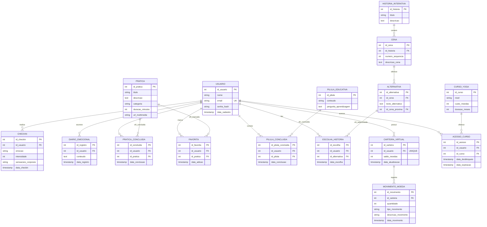

# affectus-lab
# affectus-lab

## Diagrama do Banco de Dados

```mermaid
erDiagram
  USUARIO ||--o{ CHECKIN : realiza
  USUARIO ||--o{ DIARIO_EMOCIONAL : escreve
  USUARIO ||--o{ PRATICA_CONCLUIDA : completa
  USUARIO ||--o{ FAVORITA : marca
  USUARIO ||--o{ PILULA_CONCLUIDA : conclui
  USUARIO ||--o{ ESCOLHA_HISTORIA : faz
  USUARIO ||--o{ CARTEIRA_VIRTUAL : possui
  USUARIO ||--o{ ACESSO_CURSO : acessa
  PRATICA ||--o{ PRATICA_CONCLUIDA : eh_concluida
  PRATICA ||--o{ FAVORITA : eh_marcada
  PILULA_EDUCATIVA ||--o{ PILULA_CONCLUIDA : eh_concluida
  HISTORIA_INTERATIVA ||--o{ CENA : contem
  CENA ||--o{ ALTERNATIVA : oferece
  ALTERNATIVA ||--o{ ESCOLHA_HISTORIA : eh_selecionada
  CARTEIRA_VIRTUAL ||--o{ MOVIMENTO_MOEDA : registra
  CURSO_YOGA ||--o{ ACESSO_CURSO : oferece

  USUARIO {
    int id_usuario PK
    string nome
    string email UK
    string senha_hash
    timestamp data_cadastro
  }

  CHECKIN {
    int id_checkin PK
    int id_usuario FK
    string emocao
    int intensidade
    string sensacoes_corporais
    timestamp data_checkin
  }

  DIARIO_EMOCIONAL {
    int id_registro PK
    int id_usuario FK
    text conteudo
    timestamp data_registro
  }

  PRATICA {
    int id_pratica PK
    string titulo
    text descricao
    string categoria
    int duracao_minutos
    string url_multimedia
  }

  PRATICA_CONCLUIDA {
    int id_concluida PK
    int id_usuario FK
    int id_pratica FK
    timestamp data_conclusao
  }

  FAVORITA {
    int id_favorita PK
    int id_usuario FK
    int id_pratica FK
    timestamp data_adicao
  }

  PILULA_EDUCATIVA {
    int id_pilula PK
    string conteudo
    text pergunta_aprendizagem
  }

  PILULA_CONCLUIDA {
    int id_pilula_concluida PK
    int id_usuario FK
    int id_pilula FK
    timestamp data_conclusao
  }

  HISTORIA_INTERATIVA {
    int id_historia PK
    string titulo
    text descricao
  }

  CENA {
    int id_cena PK
    int id_historia FK
    int numero_sequencia
    text descricao_cena
  }

  ALTERNATIVA {
    int id_alternativa PK
    int id_cena FK
    text texto_alternativa
    int id_cena_proxima FK
  }

  ESCOLHA_HISTORIA {
    int id_escolha PK
    int id_usuario FK
    int id_alternativa FK
    timestamp data_escolha
  }

  CARTEIRA_VIRTUAL {
    int id_carteira PK
    int id_usuario FK "UNIQUE"
    int saldo_moedas
    timestamp data_atualizacao
  }

  MOVIMENTO_MOEDA {
    int id_movimento PK
    int id_carteira FK
    int quantidade
    string tipo_movimento
    string descricao_movimento
    timestamp data_movimento
  }

  CURSO_YOGA {
    int id_curso PK
    string nivel
    int custo_moedas
    int duracao_meses
  }

  ACESSO_CURSO {
    int id_acesso PK
    int id_usuario FK
    int id_curso FK
    timestamp data_desbloqueio
    timestamp data_expiracao
  }
```
